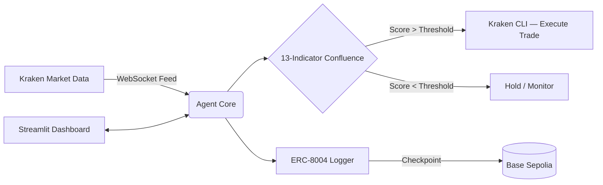

<div align="center">

# Street_07

**Autonomous BTC Trading Agent**

[](https://python.org)
[](https://docs.kraken.com/cli/)
[](https://base.org)
[](LICENSE)

An autonomous crypto trading agent that monitors live BTC market data, evaluates conditions using a 13-indicator confluence strategy, and executes trades via Kraken CLI — with on-chain trustless logging via ERC-8004.

> Built for the **Surge × Kraken AI Trading Agents Hackathon** on lablab.ai

</div>

---

## ▸ Features

- **13-Indicator Confluence Engine** — VWAP, MACD, RSI, Heiken Ashi, Parabolic SAR, EMAs, and more. The agent calculates a real-time composite market score before entering any position.
- **Kraken CLI Execution** — Automatically places `[DRY RUN]` paper trades when the confluence score crosses the entry threshold.
- **ERC-8004 On-Chain Logging** — Registers agent identity and logs every trade intent as an immutable checkpoint on Base Sepolia.
- **Risk Management** — Session filters (Tokyo/London/NY bands), 1% risk profiling, and a 3-tranche exit strategy (Stop Loss → TP1 → TP2).
- **Streamlit Dashboard** — Local web UI to start, stop, and monitor the agent's live terminal output.

---

## ▸ Architecture



---

## ▸ Prerequisites

- **Python 3.8+**
- **Kraken CLI** — configured with a Read-Only API key ([docs](https://docs.kraken.com/cli/))
- **Web3 Wallet** — loaded with Base Sepolia testnet ETH
- **Pinata / IPFS** — for Agent Card URI hosting

---

## ▸ Setup

```bash
git clone https://github.com/shashankrpatil077-ctrl/Street_07.git
cd Street_07
pip install -r requirements.txt
```

Create a `.env` file in the root directory:

```env
KRAKEN_API_KEY=your_kraken_api_key
KRAKEN_PRIVATE_KEY=your_kraken_private_key
WEB3_WALLET_PRIVATE_KEY=your_wallet_private_key
RPC_URL=your_base_sepolia_rpc_url
PINATA_API_KEY=your_pinata_api_key
PINATA_SECRET_API_KEY=your_pinata_secret_key
```

---

## ▸ Usage

**Dashboard mode:**
```bash
streamlit run app.py
```

**Direct execution:**
```bash
python agent.py
```

---

## ▸ License

MIT License — see [LICENSE](LICENSE) for details.
