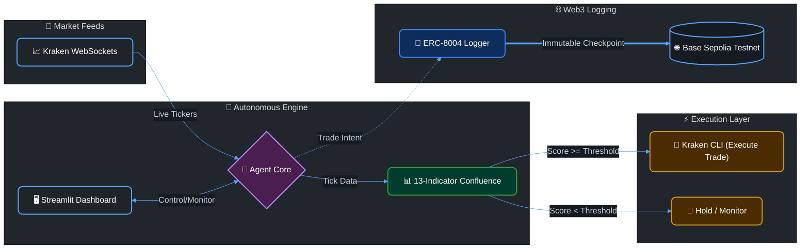

<!-- Animated Header -->


<div align="center">

[](https://python.org)
[](https://docs.kraken.com/cli/)
[](https://base.org)
[](LICENSE)

<br/>


</div>

---

## ▸ Overview

**Street_07** is an autonomous crypto trading agent that monitors live Bitcoin market data, evaluates trading conditions using a 13-indicator confluence strategy, and executes trades via the Kraken CLI. It features on-chain trustless execution by registering its agent identity and logging trade intents on Base Sepolia using the **ERC-8004** standard.

---

## ▸ Features

<table>
  <tr>
    <td width="25%" align="center"><strong>Confluence Engine</strong></td>
    <td>13 technical indicators — VWAP, MACD, RSI, Heiken Ashi, Parabolic SAR, EMAs, and more. Calculates a real-time composite market score before any position entry.</td>
  </tr>
  <tr>
    <td align="center"><strong>Kraken Execution</strong></td>
    <td>Automatically places <code>[DRY RUN]</code> paper trades via Kraken CLI when the confluence score crosses the entry threshold.</td>
  </tr>
  <tr>
    <td align="center"><strong>On-Chain Logging</strong></td>
    <td>Registers agent identity and logs every trade intent as an immutable ERC-8004 checkpoint on Base Sepolia.</td>
  </tr>
  <tr>
    <td align="center"><strong>Risk Management</strong></td>
    <td>Session filters (Tokyo/London/NY bands), 1% risk profiling, and a 3-tranche exit strategy (Stop Loss → TP1 → TP2).</td>
  </tr>
  <tr>
    <td align="center"><strong>Live Dashboard</strong></td>
    <td>Streamlit web UI to start, stop, and monitor the agent's live terminal output and indicator states.</td>
  </tr>
</table>

---

## ▸ Architecture



---

## ▸ Indicators

<details>
<summary><strong>View all 13 indicators used in the confluence engine</strong></summary>
<br/>

| # | Indicator | Signal Type |
|---|---|---|
| 1 | **VWAP** | Volume-weighted average price |
| 2 | **MACD** | Trend momentum + signal crossover |
| 3 | **RSI** | Overbought / oversold detection |
| 4 | **Heiken Ashi** | Smoothed candlestick patterns |
| 5 | **Parabolic SAR** | Trend direction + trailing stop |
| 6 | **EMA 9** | Short-term exponential moving average |
| 7 | **EMA 21** | Medium-term exponential moving average |
| 8 | **EMA 50** | Long-term trend filter |
| 9 | **Bollinger Bands** | Volatility + mean reversion |
| 10 | **Stochastic RSI** | Momentum oscillator |
| 11 | **ADX** | Trend strength measurement |
| 12 | **OBV** | On-balance volume flow |
| 13 | **ATR** | Average true range for position sizing |

Each indicator votes ±1. The composite score determines entry/exit signals.

</details>

---

## ▸ Prerequisites

- **Python 3.8+**
- **Kraken CLI** — configured with a Read-Only API key ([docs](https://docs.kraken.com/cli/))
- **Web3 Wallet** — loaded with Base Sepolia testnet ETH
- **Pinata / IPFS** — for Agent Card URI hosting

---

## ▸ Setup

```bash
git clone https://github.com/shashankrpatil077-ctrl/Street_07.git
cd Street_07
pip install -r requirements.txt
```

Create a `.env` file in the root directory:

```env
KRAKEN_API_KEY=your_kraken_api_key
KRAKEN_PRIVATE_KEY=your_kraken_private_key
WEB3_WALLET_PRIVATE_KEY=your_wallet_private_key
RPC_URL=your_base_sepolia_rpc_url
PINATA_API_KEY=your_pinata_api_key
PINATA_SECRET_API_KEY=your_pinata_secret_key
```

---

## ▸ Usage

**Dashboard mode:**
```bash
streamlit run app.py
```

**Direct execution:**
```bash
python agent.py
```

---

## ▸ License

MIT License — see [LICENSE](LICENSE) for details.

<!-- Animated Footer -->

