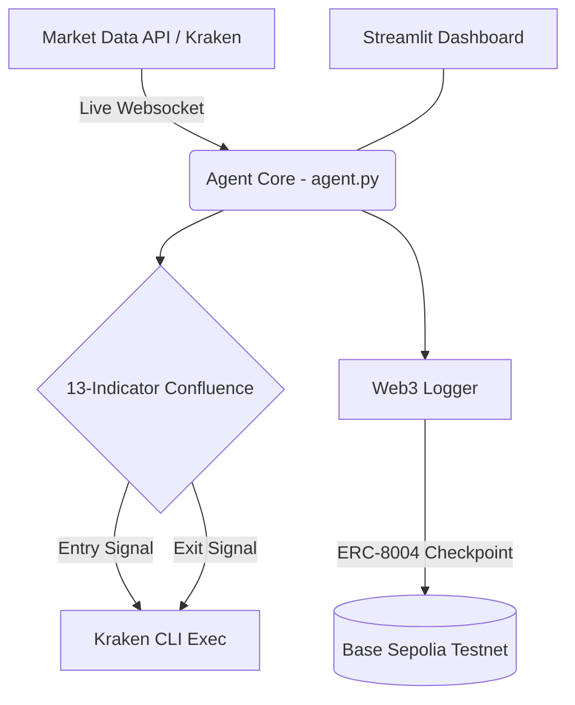

# 🚀 Street_07: Autonomous BTC Trading Agent

[](https://opensource.org/licenses/MIT)
[](https://www.python.org/downloads/)
[](https://base.org)

> Built for the **Surge x Kraken AI Trading Agents Hackathon** on lablab.ai.

**Street_07** is an autonomous crypto trading agent that monitors live Bitcoin (BTC) market data, evaluates trading conditions using 13 technical indicators, and executes trades via the Kraken CLI. It features a Trustless/Web3 integration by registering its agent identity and trade intents on the Base Sepolia testnet using the ERC-8004 standard.

---

## ✨ Features

- **Algorithmic Trading Engine:** Utilizes 13 built-in indicators (VWAP, MACD, RSI, Heiken Ashi, Parabolic SAR, EMAs, etc.) to calculate a real-time market score.
- **Kraken CLI Integration:** Automatically executes `[DRY RUN]` paper trades on Kraken when the market score crosses the entry threshold.
- **Web3 Trustless Execution (ERC-8004):** Registers the agent's identity and logs trade intents as on-chain checkpoints on Base Sepolia.
- **Risk Management:** Includes session filters (Tokyo/London/NY bands), 1% risk profiling, and a 3-tranche exit strategy (Stop Loss, Take Profit 1, Take Profit 2).
- **Live Streamlit Dashboard:** A local web UI (`app.py`) to easily start, stop, and monitor the agent's live terminal logs.

---

## 🏗️ System Architecture



---

## 🛠️ Prerequisites

- **Python 3.8+**
- **Kraken CLI** ([Documentation](https://docs.kraken.com/cli/)) configured with a Read-Only API key.
- A **Web3 Wallet** (e.g., MetaMask) loaded with Base Sepolia testnet ETH.
- **Pinata / IPFS** account for Agent Card URI hosting.

---

## ⚙️ Installation & Setup

1. **Clone the repository:**
   ```bash
   git clone https://github.com/shashankrpatil077-ctrl/Street_07.git
   cd Street_07
   ```

2. **Install dependencies:**
   ```bash
   pip install -r requirements.txt
   ```

3. **Configure Environment Variables:**
   Create a `.env` file in the root directory and add the following keys:
   ```env
   KRAKEN_API_KEY=your_kraken_api_key
   KRAKEN_PRIVATE_KEY=your_kraken_private_key
   WEB3_WALLET_PRIVATE_KEY=your_wallet_private_key
   RPC_URL=your_base_sepolia_rpc_url
   PINATA_API_KEY=your_pinata_api_key
   PINATA_SECRET_API_KEY=your_pinata_secret_key
   ```

---

## 🚀 Usage

**To run the agent via the dashboard:**
```bash
streamlit run app.py
```
This will launch a local dashboard where you can monitor indicators, logs, and start/stop the trading engine.

**To run the agent directly:**
```bash
python agent.py
```

---

## 📜 License
This project is licensed under the MIT License - see the [LICENSE](LICENSE) file for details.
